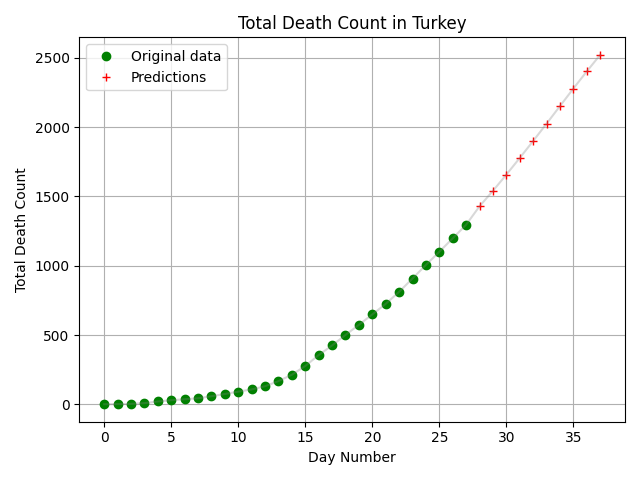
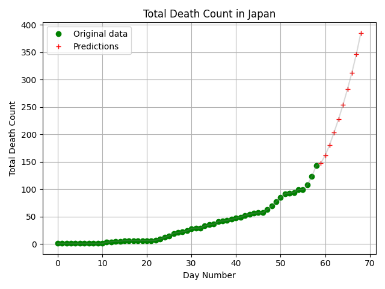
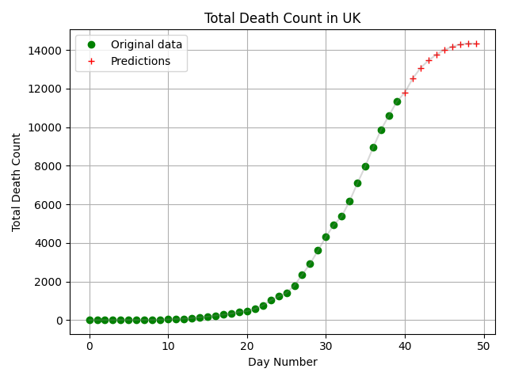

# coronavirus-timeseries-predictor
Timeseries analyzer for coronavirus with recurrent neural network

## Prediction with RNN
For model, [Keras](https://keras.io/) library is used, and model structured as stacked recurrent neural network. In my implementation, there
are three LSTM layers, and each of them has their own dropout layer for regularization. At the end, there is a single
dense layer which is used for obtaining regression result. 

For the feature vector, I decided to use **previous days' data with specific day interval**. In other words, the created
RNN model maps occurred total death counts to next day's total death count. Size of feature vector can be configurable
in implementation. You can change target directory i.e. target of training by configuring it in predictor file. I output
crawler data so that it can be easily changed.

**Note:** Still there are few data we obtained around the world. The size of data may not be applicable for training of
such a large network. I played layer counts, neuron counts of layers, activation functions and other hyper parameters;
however, expected numbers could deviate unexpectedly. But at least, I thought that having initial implementation for 
such a case can be helpful for other curious people.

**Note:** Because of the above concern, I do not choose to train my models on particular country (because of lack of 
necessary data count). I choose to train my model with all data available for all countries so that maybe I can catch
some point of direction increase in the virus spread speed collectively for all countries.  

Several figures are placed here:







## Crawler
The project not just include predictor/analysis part for coronavirus, but also creation of
dataset for the training. The main source for dataset is [Worldometer](https://www.worldometers.info/)
web page Coronovirus section.

Crawling is done with the following procedure:
* Firstly, all the available counties are fetched and filtered from the table.
* Then, web scrapping procedure starts for each fetched country.
* Each country's detail page parsed and daily data is obtained from graphs included in the
detail page of particular country.

Under crawler package, one could find the following files.

### Synchronous Crawler
Synchronous scrapper class where HTTP requests are forwarded via **urllib** module of python.
For parsing, [**beautifulsoup4**](https://www.crummy.com/software/BeautifulSoup/bs4/doc/) module is used.

### Asynchronous Crawler
Pretty similar to synchronous counterpart with just [**aiohttp**](https://docs.aiohttp.org/en/stable/)
take place of synchronous network access and main loop of **asyncio** controls the flow.

### Dataset Output
Output of obtained data is written into **CSV** formatted files under **resources** directory which
can be found at the same level with **src** directory. Current version of CSV files have two columns
of data where the first column includes date information and the second one consists corresponding
values for particular information (ex: *Active Cases* or *Daily Deaths*).

File structure will be as follows.

```shell
$ ls
LICENSE  README.md  resources  src
$ ls resources/
'Active Cases'  'Daily Deaths'  'Daily New Cases'  'New Cases vs. New Recoveries'  'Outcome of total closed cases (recovery rate vs death rate)'  'Total Cases'  'Total Deaths'
$ ls resources/Active\ Cases/
afghanistan.csv          bermuda.csv                 china.csv               ethiopia.csv          guyana.csv       kyrgyzstan.csv     moldova.csv          panama.csv                 seychelles.csv              thailand.csv
albania.csv              bhutan.csv                  colombia.csv            faeroe_islands.csv    haiti.csv        laos.csv           monaco.csv           papua_new_guinea.csv       sierra_leone.csv            timor-leste.csv
algeria.csv              bolivia.csv                 congo.csv               falkland_islands.csv  honduras.csv     latvia.csv         mongolia.csv         paraguay.csv               singapore.csv               togo.csv
andorra.csv              bosnia_and_herzegovina.csv  costa_rica.csv          fiji.csv              hong_kong.csv    lebanon.csv        montenegro.csv       peru.csv                   sint_maarten.csv            trinidad_and_tobago.csv
angola.csv               botswana.csv                croatia.csv             finland.csv           hungary.csv      liberia.csv        montserrat.csv       philippines.csv            s._korea.csv                tunisia.csv
anguilla.csv             brazil.csv                  cuba.csv                france.csv            iceland.csv      libya.csv          morocco.csv          poland.csv                 slovakia.csv                turkey.csv
antigua_and_barbuda.csv  british_virgin_islands.csv  curaçao.csv             french_guiana.csv     india.csv        liechtenstein.csv  mozambique.csv       portugal.csv               slovenia.csv                turks_and_caicos.csv
argentina.csv            brunei.csv                  cyprus.csv              french_polynesia.csv  indonesia.csv    lithuania.csv      myanmar.csv          qatar.csv                  somalia.csv                 uae.csv
armenia.csv              bulgaria.csv                czechia.csv             gabon.csv             iran.csv         luxembourg.csv     namibia.csv          réunion.csv                south_africa.csv            uganda.csv
aruba.csv                burkina_faso.csv            denmark.csv             gambia.csv            iraq.csv         macao.csv          nepal.csv            romania.csv                south_sudan.csv             uk.csv
australia.csv            burundi.csv                 djibouti.csv            georgia.csv           ireland.csv      madagascar.csv     netherlands.csv      russia.csv                 spain.csv                   ukraine.csv
austria.csv              cabo_verde.csv              dominica.csv            germany.csv           isle_of_man.csv  malawi.csv         new_caledonia.csv    rwanda.csv                 sri_lanka.csv               uruguay.csv
azerbaijan.csv           cambodia.csv                dominican_republic.csv  ghana.csv             israel.csv       malaysia.csv       new_zealand.csv      saint_kitts_and_nevis.csv  st._barth.csv               usa.csv
bahamas.csv              cameroon.csv                drc.csv                 gibraltar.csv         italy.csv        maldives.csv       nicaragua.csv        saint_lucia.csv            st._vincent_grenadines.csv  uzbekistan.csv
bahrain.csv              canada.csv                  ecuador.csv             greece.csv            ivory_coast.csv  mali.csv           niger.csv            saint_martin.csv           sudan.csv                   vatican_city.csv
bangladesh.csv           car.csv                     egypt.csv               greenland.csv         jamaica.csv      malta.csv          nigeria.csv          saint_pierre_miquelon.csv  suriname.csv                venezuela.csv
barbados.csv             caribbean_netherlands.csv   el_salvador.csv         grenada.csv           japan.csv        martinique.csv     north_macedonia.csv  san_marino.csv             sweden.csv                  vietnam.csv
belarus.csv              cayman_islands.csv          equatorial_guinea.csv   guadeloupe.csv        jordan.csv       mauritania.csv     norway.csv           sao_tome_and_principe.csv  switzerland.csv             western_sahara.csv
belgium.csv              chad.csv                    eritrea.csv             guatemala.csv         kazakhstan.csv   mauritius.csv      oman.csv             saudi_arabia.csv           syria.csv                   yemen.csv
belize.csv               channel_islands.csv         estonia.csv             guinea-bissau.csv     kenya.csv        mayotte.csv        pakistan.csv         senegal.csv                taiwan.csv                  zambia.csv
benin.csv                chile.csv                   eswatini.csv            guinea.csv            kuwait.csv       mexico.csv         palestine.csv        serbia.csv                 tanzania.csv                zimbabwe.csv
palestine.csv            serbia.csv                  tanzania.csv            zimbabwe.csv
```